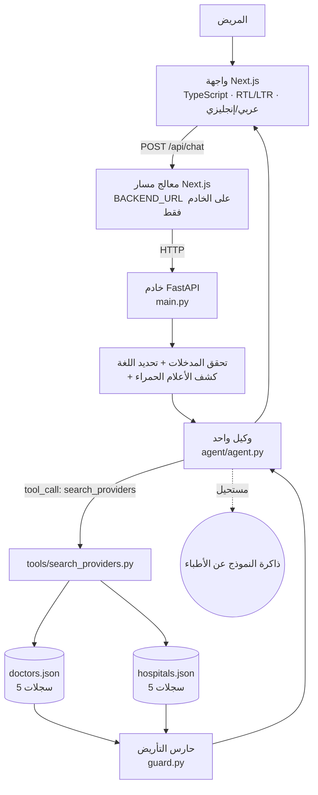

# HealTrip — مساعد المريض الذكي للقرارات (HealTrip AI Patient Decision Assistant)

> هذه نسخة عربية من التوثيق. | [English version](./README.md)

**نموذج تقني ثنائي اللغة (عربي / إنجليزي) لدعم القرار الطبي.**
يكتب المريض وصفه لحالته، فيسأله وكيل ذكاء اصطناعي واحد سؤالًا توضيحيًا عند الحاجة،
ويرصد الحالات الطارئة الواضحة، ويقترح الخطوة التالية. وأي طبيب أو مستشفى يذكره
الوكيل يأتي حصرًا من **استدعاء أداة مُتحقَّق منها** على قاعدة بيانات تجريبية
صغيرة — ولا يأتي من ذاكرة النموذج إطلاقًا.

> ⚠️ **إخلاء مسؤولية.** هذا نموذج أولي (Prototype) لأغراض التوظيف الفني، وليس
> جهازًا طبيًا. لا يقدّم تشخيصًا. جميع الأطباء (5) والمستشفيات (5) سجلات توضيحية
> خيالية بوضوح.

> 🔗 **نسخة حية:** <https://healtrip-ai.vercel.app> — الخدمتان تعملان في مشروع Vercel
> واحد (Next.js + FastAPI، راجع القسم 15).

---

## 1. نظرة عامة على المشروع

يكتب المريض شيئًا مثل:

> "عندي ألم في الصدر ولا أعرف هل أذهب لطبيب قلب أم إلى الطوارئ أم آخذ رأيًا ثانيًا."

النظام **لا يجب** أن ينتج توصية عشوائية فورًا، بل:

1. يفهم الرسالة (عربي أو إنجليزي)،
2. يطرح سؤال توضيحيًا عند نقص السياق،
3. يوجّه الحالات ذات الأعلام الحمراء الواضحة ("ألم شديد في الصدر ولا أستطيع التنفس")
   إلى رعاية شخصية فورية،
4. يستدعي أداة في الخادم **فقط** عندما تكون معلومات مزوّدي الخدمة مطلوبة،
5. يعيد أطباء ومستشفيات موجودة فعليًا في `doctors.json` / `hospitals.json`،
6. يكون صريحًا عند عدم وجود تطابق.

هذا نموذج **دعم قرار**: لا يذكر تشخيصًا في أي حال.

---

## 2. البنية المعمارية (Architecture)

```text
المريض
   ↓
واجهة المحادثة (Next.js + TypeScript، دعم RTL/LTR)
   ↓  POST /api/chat        (المتصفح لا يتحدث إلا مع نفس الأصل)
معالج المسار في Next.js (frontend/app/api/chat/route.ts)
   ↓  طلب من الخادم إلى BACKEND_URL
خادم FastAPI
   ↓  التحقق من المدخلات ← كشف الأعلام الحمراء ← تحديد اللغة
وكيل ذكاء اصطناعي واحد (agent/agent.py)
   ↓  "هل أحتاج معلومات مزوّدي خدمة؟"
   ├── لا  → إجابة نهائية
   └── نعم → استدعاء أداة: search_providers()
                ↓
          doctors.json / hospitals.json  (+ doctors.hospital_id → hospitals.id)
                ↓
          نتيجة أداة مُتحقَّق منها
                ↓
          الوكيل → رد مبني على البيانات + بطاقات مزوّدي خدمة مُتحقَّق منها
   ↓
واجهة المحادثة
```



القاعدة الجوهرية:

```text
النموذج → الأداة → البيانات التجريبية → نتيجة مُتحقَّق منها → رد النموذج
```

لا يوجد أي طريق يتيح للنموذج الوصول إلى سجل طبيب/مستشفى لم يأتِ من نتيجة أداة.

---

## 3. نموذج البيانات (Data Model)

ملفان، خمسة سجلات في كلٍّ منهما، ومفتاح أجنبي واحد:

```text
doctors.json
   d1 … d5          hospital_id ──┐
                                   ↓
hospitals.json
                  h1 … h5  (id)
```

- العلاقة `doctors.hospital_id → hospitals.id` علاقة حقيقية: عند إرجاع الأداة
  لسجل طبيب، ي resolve الـ backend حقل `hospital_id` مقابل `hospitals.json`
  ويرفق اسم المستشفى وعنوانه وعلم `emergency_available` في نفس النتيجة.
- يتم التحقق من السجلين بنماذج Pydantic عند التحميل؛ أي ملف تالف يفشل بسرعة
  مع `MockDataError` بدل إنتاج إجابات ناقصة.
- كل سجل يحمل `name` و `name_ar` حتى تكون الردود العربية مبنية على نفس السجل
  المُتحقَّق منه بدلًا من transliteration مُختلَقة.

هذه البنية تحاكي نموذجًا علائقيًا بسيطًا يمكن نقله لاحقًا إلى PostgreSQL
(`doctors.hospital_id REFERENCES hospitals(id)`). **لا توجد قاعدة بيانات في هذا النموذج.**

---

## 4. تدفّق البيانات (Data Flow)

مثال: *"I need a cardiologist in Riyadh."*

1. يرسل المريض الرسالة في واجهة Next.js.
2. ترسل الواجهة `POST` بالشكل `{ message, language, history }` إلى `/api/chat`.
3. يمرّر معالج المسار الطلب من الخادم إلى `BACKEND_URL/api/chat`.
   لا يصل `BACKEND_URL` ولا مفتاح الـ LLM إلى المتصفح أبدًا.
4. يتحقق FastAPI من الحمولة (Pydantic) ويحدد اللغة (`ar` / `en`).
5. يعمل فحص الأعلام الحمراء. جملة "I need a cardiologist in Riyadh" ليست عرضًا
   لأعراض ولا حالة طارئة، لذلك لا تُضاف توجيهات سلامة.
6. تُرسل الرسالة مع system prompt إلى الـ LLM.
7. يستدعي الوكيل:
   `search_providers(provider_type="doctor", specialty="Cardiology", city="Riyadh")`.
8. يبحث الـ backend في `doctors.json` (تطبيع `canon()` يحوّل "cardiologist" أو
   "cardio" أو "heart doctor" إلى *Cardiology*).
9. يُعثر على `Dr. Ahmed Salem`.
10. يُحلّ `hospital_id = "h1"` مقابل `hospitals.json`
    (Al-Noor Demo Hospital، حي العليا، خدمة طوارئ متوفرة).
11. يُعاد السجل المُتحقَّق منه إلى الوكيل كنتيجة للأداة.
12. يكتب الوكيل الإجابة **مستخدمًا هذا السجل فقط**.
13. يعيد `guard.py` فحص النص: كل اسم طبيب/مستشفى ذُكر يجب أن يكون موجودًا في
    البيانات، وإلا يُستبدل الرد برسالة آمنة.
14. تعيد الواجهة `{ reply, providers, tools_used, urgent, grounded }`.
15. تعرض الواجهة النص مع بطاقات مزوّدي الخدمة المُتحقَّق منهم.

إذا لم يوجد تطابق، تُعيد الأداة `match_count: 0` ويُوجَّه الوكيل للقول:
*"لم أجد مقدم خدمة مطابقًا في بيانات العرض المتاحة."*

---

## 5. تصميم الوكيل الذكي (AI Agent Design)

**وكيل واحد فقط.** بلا multi-agent، وبلا LangGraph، وبلا إطار وكلاء — مجرد
حلقة `LLM → استدعاء أداة → نتيجة → LLM` في `agent/agent.py`.

- **System prompt** يحدّد المهمة ثم القواعد الصارمة: معلومات مزوّدي الخدمة تأتي من
  نتيجة الأداة فقط، لا تختلق مقدم خدمة، اطرح **سؤالًا توضيحيًا واحدًا**، لا
  تذكر تشخيصًا، أجب بلغة المريض، وكن مختصرًا.
- **السياق**: آخر 8 أدوار يرسلها المتصفح. لا توجد جلسة في الخادم ولا قاعدة بيانات
  ولا ذاكرة طويلة المدى.
- **التوضيح**: من (أ)طلب الوكيل سؤالًا قصيرًا عند نقص السياق، و(ب) إضافة توجيه
  `CLARIFICATION` من `safety.py` عند ذكر أعراض دون حالة طارئة.
- **الاستعجال**: يكتشف `safety.py` عبارة دالة على حالة طارئة ويضيف توجيه
  `URGENCY` يفرض سلوك "الرعاية الفورية أولًا" بدل ترشيح موعد روتيني.
- **اللغة**: تُكتشف تلقائيًا من الرسالة (وجود حروف عربية ⇒ `ar`)، ويمكن أيضًا
  فرضها من مبدّل اللغة في الواجهة؛ وهي تحدد system prompt ورسائل الخطأ واتجاه
  الواجهة.
- **صمام أمان للحلقة**: `MAX_TOOL_ROUNDS` (الافتراضي 5) يوقف أي حلقة مفرطة.

---

## 6. استدعاء الأدوات (Tool Calling)

استدعاء دوال أصلي (OpenAI-compatible) عبر `httpx` مباشرة — بلا SDK، فتغيير
المزوّد هو تعديل في `.env` فقط.

| الأداة | الغرض |
| --- | --- |
| `search_providers(provider_type, specialty?, city?, language?)` | الطريق الوحيد الذي تصل به بيانات مزوّدي الخدمة إلى النموذج. `provider_type` يحدّد `doctors.json` أو `hospitals.json`. |
| `list_provider_filters()` | يعيد التخصصات والمدن واللغات الموجودة فعلًا، ليستعلم الوكيل بقيم يمكن أن تُطابق بيانات العرض. |

سلوك البحث:

- المرشّحات اختيارية وتُدمج بمنطق AND؛
- القيم تُطبَّع (`cardiologist` / `cardio` / `heart doctor` ← `Cardiology`،
  و `En` ← `English`) وتُطابق بالتطابق التام أو作为一个 سلسلة فرعية؛
- نتائج الأطباء تُثرى ببيانات المستشفى是他们 (حل العلاقة)؛
- الحمولة المُعادة إلى النموذج تحتوي `match_count` مع ملاحظة صريحة أن
  التطابقات هي **كل** مزوّدي الخدمة الحقيقيين.

تعيد الواجهة أيضًا `tools_used` (اسم الأداة + الوسائط + عدد التطابقات) لتُظهر
لماذا استدعى الوكيل أداة — مفيد أثناء العرض على المقابلات.

---

## 7. منع الهلوسة (Hallucination Prevention)

أربع طبقات، من الأقوى إلى الأضعف:

1. **تحكم بالتصميم** — الـ system prompt لا يحتوي أي بيانات مزوّدي خدمة، والوكيل
   لا يستطيع قراءة ملفات JSON. الحقائق الوحيدة التي يراها هي نتائج الأدوات.
2. **مفردات مغلقة** — يُطلب من الوكيل نسخ الأسماء حرفيًا من نتيجة الأداة، وأن
   عدم وجود سجل يعني "غير موجود في بيانات العرض"، لا "إليك شيئًا مشابهًا من
   الذاكرة".
3. **عرض مُؤرَّض (grounded)** — بطاقات مزوّدي الخدمة في الواجهة تُبنى من مصفوفة
   `providers` المُعادة من الـ backend، لا من النص. حتى لو أخطأ النص تبقى
   البطاقات سجلات حقيقية.
4. **حارس `guard.py`** — بعد توليد الرد، تُقارن كل عبارة تبدو كاسم طبيب/مستشفى
   (`Dr. X`، `… Hospital`، `مستشفى …`، `د. …`) ببيانات العرض. إذا ظهر اسم غير
   معروف، يُهمَل الرد ويُستبدل برسالة آمنة (عربي أو إنجليزي)، وتُسجَّل الأسماء
   غير الموثقة في الخادم فقط — لا تُعاد للمتصفح.

```text
if the reply mentions a provider that is not in the mock data:
    reply = safe_fallback(language)
    providers = []          # البطاقات تُحذف أيضًا
else:
    reply, providers = as-generated
```

---

## 8. السلامة الطبية (Medical Safety)

مقصود أن تكون **بسيطة وواضحة** — ليست محرك فرز طبيًا:

- في `safety.py` قائمتان قصيرتان من الكلمات (إنجليزي وعربي):
  *الأعلام الحمراء* (ألم شديد في الصدر، صعوبة التنفس، الإغماء/فقدان الوعي،
  نزيف شديد، علامات جلطة، تشنّج، اختناق، حساسية شديدة…) و*ذكر الأعراض*
  (ألم، حرارة، دوار، غثيان، طفح…).
- أعلام حمراء ← يُوجَّه الوكيل لأن تكون الرعاية الشخصية الفورية (أقرب قسم
  طوارئ أو رقم الطوارئ المحلي) **أولًا**، لا موعدًا روتينيًا، مع عدم طمأنة
  المريض وتأجيل الرد بأسئلة. لا يفترض أي رقم طوارئ خاص بدولة (مثل 911).
  كما تعيد الواجهة `urgent: true` مع `safety_notice`، ويعرض الشريط الأحمر في
  الواجهة.
- ذكر أعراض دون أعلام حمراء ← يُوجَّه الوكيل لطرح سؤال توضيحي واحد قبل أي ترشيح.
- الـ system prompt يمنع التشخيص واليقين في كل رد، ويعرض تذييل الواجهة أن الأداة
  لا تُغني عن الطبيب أو خدمات الطوارئ.

**الحدود**: الكشف بالكلمات المفتاحية غير مُتحقَّق منه سريريًا، وقد يُفوِّت صياغات
أخرى ويُنتج إيجابيات كاذبة. أي نظام دعم قرار حقيقي يحتاج قواعد فرز مُتحقَّق منها
ومراجعة سلامة سريرية، ودراسة تنظيمية — وكل ذلك خارج نطاق هذا النموذج.

---

## 9. الأمان (Security)

- **المفاتيح تبقى في الخادم**: يُقرأ مفتاح الـ LLM من متغيّرات البيئة في
  `backend/settings.py` ولا يُستخدم إلا داخل عملية FastAPI. لا يصل إلى المتصفح،
  ولا يظهر في أي استجابة، وتم التأكد من **غيابه عن حزمة Next.js المبنية**.
- **متغيّرات البيئة فقط**، مع `.env.example` يوثّق كل متغيّر و`.env` مُستثنى من git.
- **تحقّق المدخلات** عبر Pydantic: حد أقصى 2000 حرف للرسالة، 12 دورًا للسجل،
  وتحقّق من `language` و `role`.
- **معالجة أخطاء آمنة**: شكل خطأ واحد
  `{"error": {"code", "message"}}` بنصوص صديقة بالعربي/الإنجليزي. لا تُعاد أخطاء
  المزوّد ولا الـ stack traces ولا المفاتيح ولا قيم البيئة (يُسجَّل رمز الحالة في
  الخادم فقط).
- **حدود الطلب**: تحديد الحجم و`MAX_TOOL_ROUNDS` يحدّان تكلفة الطلب الواحد.
- **الخصوصية**: سياق المحادثة يبقى في المتصفح ويُرسل مع كل طلب؛ لا تخزين، ولا
  تحليلات، ولا كتابة لمحتوى المحادثة في السجلات (رمز الخطأ ونوع خطأ التحقق فقط).
- لا مصادقة (Authentication) عن قصد (خارج النطاق) — لا يُستخدم هذا النموذج مع
  بيانات مرضى حقيقية.

مسارات الفشل المُعالَجة (تم التحقق منها جميعًا):

| الحالة | الاستجابة |
| --- | --- |
| غياب `LLM_API_KEY` | `503 missing_api_key` |
| مفتاح خاطئ / خطأ المزوّد / تعذّر الوصول | `502 llm_unavailable` |
| انتهاء مهلة المزوّد | `504 llm_timeout` |
| رسالة فارغة أو غير صالحة | `422 invalid_request` |
| بيانات JSON تالفة | `500 mock_data_error` |
| وسائط أداة خاطئة | الأداة تعيد `{"error": ...}` للنموذج بدون انهيار |
| تعذّر الوصول للـ backend (من الواجهة) | `502 backend_unreachable` |
| خطأ غير متوقع | `500 internal_error` |

---

## 10. لماذا بيانات JSON تجريبية؟ (Why Mock JSON Data?)

هذا نموذج أولي محدود زمنيًا يركّز على إظهار سلوك وكيل الذكاء الاصطناعي
واستدعاء الأدوات والتأريض الآمن للبيانات والتكامل بين الواجهة والخادم. ملفات JSON
المحلية تجعله سهل التشغيل والمراجعة والشرح — `cat doctors.json` هي كامل
"قاعدة البيانات" — مع الحفاظ على نموذج بيانات واضح يمكن نقله لاحقًا إلى
PostgreSQL أو أي مخزن دائم. إضافة قاعدة بيانات هنا تعني بنية تحتية دون أن تضيف
شيئًا يُقيَّم في هذا التكليف.

## 11. لماذا أطباء ومستشفيات منفصلان؟ (Why Separate Doctors and Hospitals?)

الأطباء والمستشفيات كيانان مختلفان لهما خصائص مختلفة (`specialty` مقابل
`specialties`، `hospital_id` مقابل `address` و `emergency_available`). إبقاءهما
منفصلين يجعل العلاقة صريحة (`doctors.hospital_id → hospitals.id`)، ويظهر أساسيات
نمذجة البيانات، وهو الشكل الذي ينتقل مباشرة إلى جدولين لاحقًا. دمجهما في سجل
واحد كان سيخفي هذه العلاقة.

---

## 12. قرارات التقنيات (Technology Decisions)

| الاختيار | السبب |
| --- | --- |
| **Next.js (App Router) + TypeScript** | واجهة full-stack صغيرة ومعروفة مع معالج مسارات على الخادم، فلا يحتاج المتصفح عنوان الـ backend. أنواع صارمة عبر حدّ الـ API. |
| **CSS عادي بدون إطار UI** | موضوع التكليف معمارية لا أنظمة تصميم؛ ملف `globals.css` واحد. |
| **FastAPI** | صغير، مُنمَّط، غير متزامن، ذاتي التوثيق — كامل الـ backend في ~6 وحدات صغيرة. |
| **بيانات JSON تجريبية** | سريعة، قابلة للمراجعة، بلا بنية تحتية (القسم 10). |
| **وكيل ذكاء اصطناعي واحد** | المقصود هو حلقة نظيفة قابلة للشرح؛ تنسيق عدة وكلاء يضيف تعقيدًا دون أن يضيف دليلًا على جودة التصميم. |
| **استدعاء دوال أصلي عبر HTTP خام** | يبقى طبقة المزوّد في وحدة صغيرة واحدة: غيّر `LLM_PROVIDER`/`LLM_BASE_URL`/`LLM_MODEL` ويعمل التطبيق بلا تعديل. بلا إطار تجريد. |
| **أداتان فقط** | `search_providers` (المطلوبة) + `list_provider_filters` الصغيرة التي تمنع النموذج من البحث بمرشّحات لا يمكن أن تُطابق — مكسب في الموثوقية بحوالي 15 سطرًا. |

إعداد المزوّد (`.env`): `LLM_PROVIDER` (`openai`، `groq`، `deepseek`، `openrouter`،
أو أي نقطة نهاية متوافقة مع OpenAI)، `LLM_API_KEY`، `LLM_MODEL`، `LLM_BASE_URL`.

---

## 13. التشغيل محليًا (Local Setup)

المتطلبات: Python 3.11+، Node.js 18+.

```bash
# 1) الخادم
cd backend
python -m venv .venv
.venv\Scripts\activate        # على macOS/Linux: source .venv/bin/activate
pip install -r requirements.txt
cd ..

# 2) الإعدادات (جذر المستودع)
cp .env.example .env          # ثم ضع LLM_API_KEY واختر LLM_PROVIDER

# 3) تشغيل الخادم (http://127.0.0.1:8000)
cd backend
uvicorn main:app --reload --port 8000

# 4) تشغيل الواجهة (http://localhost:3000) في طرفية ثانية
cd frontend
npm install
npm run dev
```

الواجهة تستخدم `BACKEND_URL=http://127.0.0.1:8000` افتراضيًا، فلا يلزم أي
إعداد إضافي محليًا. لتغيير العنوان أنشئ `frontend/.env.local` يحتوي
`BACKEND_URL=...`.

جرّب:

- `I need a cardiologist in Riyadh.` → استدعاء أداة + طبيب ومُستشفى مُتحقَّق منهما
- `I have chest pain and I'm not sure what to do.` → سؤال توضيحي
- `I have severe chest pain and I cannot breathe.` → شريط استعجال، بدون ترشيح روتيني
- `Is there a dermatologist in Riyadh?` → رد صريح "غير موجود في بيانات العرض"
- `أريد طبيب قلب في الرياض.` → نفس المسار بالعربية مع تخطيط RTL

الاختبارات (تعمل بدون إنترنت أو مفتاح):

```bash
cd backend && python -m pytest tests -q     # 27 اختبارًا بدون اتصال
cd frontend && npm run typecheck && npm run build
```

تغطي: تحميل بيانات العرض والتحقق منها (JSON تالف/مفقود)، البحث في الأطباء
والمستشفيات، المرشّحات بالصياغة الطبيعية، حل علاقة `hospital_id`، حلقة الوكيل
مع عميل LLM وهمي (تنفيذ الأدوات، صدق عدم التطابق، وسائط الأداة الخاطئة)، كشف
الأعلام الحمراء والأعراض، تحديد اللغة، وحارس الهلوسة في اللغتين.

---

## 14. متغيّرات البيئة (Environment Variables)

| المتغيّر | يُستخدم في | الافتراضي | الوصف |
| --- | --- | --- | --- |
| `LLM_PROVIDER` | backend | `openai` | `openai`، `groq`، `deepseek`، `openrouter` (وسم فقط). |
| `LLM_API_KEY` | backend | – | **مطلوب.** لا يصل إلى المتصفح أبدًا. |
| `LLM_MODEL` | backend | حسب المزوّد | مثال: `gpt-4o-mini`، `openai/gpt-oss-120b`، `deepseek-chat`. |
| `LLM_BASE_URL` | backend | حسب المزوّد | تجاوز لأي نقطة نهاية متوافقة مع OpenAI. |
| `LLM_TIMEOUT_SECONDS` | backend | `45` | مهلة الاتصال بالمزوّد. |
| `MAX_TOOL_ROUNDS` | backend | `5` | سقف حلقة استدعاء الأدوات. |
| `CORS_ORIGINS` | backend | `http://localhost:3000` | قائمة مفصولة بفواصل، للتطوير المحلي فقط. |
| `BACKEND_URL` | frontend (خادم) | `http://127.0.0.1:8000` | عنوان الـ backend الذي يستخدمه معالج المسار. على Vercel يُحقنه service binding تلقائيًا — لا تضبطه يدويًا. |

ملف `.env.example` مُودَع في المستودع، و `.env` غير مُودَع.

---

## 15. النشر على Vercel

تُنشر الخدمتان معًا في **مشروع Vercel واحد** عبر Vercel Services (يكتشف كل
إطار عمل داخل خدمته، وتُبنى كل خدمة بشكل مستقل، ويتقاسمان نطاقًا واحدًا).
وكل النشر موصوف في ملف `vercel.json` المُودَع:

```json
{
  "services": {
    "frontend": {
      "root": "frontend/",
      "framework": "nextjs",
      "bindings": [
        { "type": "service", "service": "backend", "format": "url", "env": "BACKEND_URL" }
      ]
    },
    "backend": { "root": "backend/", "framework": "fastapi", "entrypoint": "main:app" }
  },
  "rewrites": [{ "source": "/(.*)", "destination": { "service": "frontend" } }]
}
```

ماذا يعني هذا عمليًا:

- `backend/` يُبنى على **Python runtime** في Vercel (Fluid compute) ويُصدّر الكائن
  `app` من `backend/main.py`. ويُضمَّن `doctors.json` و `hospitals.json` داخل حزمة
  الدالة ويُقرآن للقراءة فقط أثناء التشغيل.
- `frontend/` يُبنى كـ **Next.js**. كل الطلبات العامة تذهب إلى خدمة الواجهة، فيبقى
  مسار `/api/chat` الذي ي talking إليه المتصفح مطابقًا تمامًا للوضع المحلي.
- **service binding** يحقن عنوان الـ backend الداخلي في الواجهة باسم
  `BACKEND_URL`. معالج المسار في Next.js يقرأ `process.env.BACKEND_URL` أصلًا،
  لذلك **لم يتغيّر أي سطر في كود التطبيق** للنشر — الطلب يمر عبر الشبكة الداخلية
  في Vercel بدل الإنترنت العام، والـ backend **غير متاح للعامة**.
- **لا تضبط `BACKEND_URL` كمتغيّر بيئة في المشروع**: الـ binding هو من يوفّره،
  وأي قيمة يدوية ستتغلّب على العنوان الداخلي.

الخطوات:

1. استورد المستودع من vercel.com/new (Root Directory = جذر المستودع ليُقرأ
   `vercel.json`).
2. أضف متغيّرات البيئة في Project Settings (تُطبَّق على الخدمتين):
   `LLM_PROVIDER` و `LLM_API_KEY` (secret) و `LLM_MODEL`. ما عدا ذلك لديه قيم
   افتراضية آمنة. و `CORS_ORIGINS` غير مطلوب هنا لأن المتصفح لا يتصل إلا بنطاق
   Next.js.
3. انشر، ثم تحقّق عبر `GET /` (الواجهة) و `POST /api/chat`
   (الواجهة ← binding ← FastAPI ← مزوّد الـ LLM).

مطابقة معرفية: الأمر `vercel dev -L` يشغّل الخدمتين بنفس التوجيهات ونفس الـ
binding المحقون، وهكذا تم التحقق من تواصل الواجهة بالـ backend قبل النشر.

بلا Docker ولا حاويات ولا مزوّد ثانٍ ولا قاعدة بيانات.

---

## 16. الحدود / تحسينات الإنتاج المستقبلية

يتوقف هذا النموذج عمدًا هنا. أي نسخة إنتاجية ستحتاج:

- PostgreSQL بدل ملفات JSON (نفس نموذج الكيانين مع ترحيلات حقيقية)،
- مصادقة وتحكّم في الصلاحيات،
- تخزين حوارات دائم ومشفّر مع سياسات احتفاظ،
- قواعد فرز طبي مُتحقَّق منها ومراجعة سلامة سريرية،
- تحديد معدّل الطلبات وضوابط التكلفة ومراقبة/تسجيل تدقيق،
- بيانات مزوّدي خدمة حقيقية بترخيص، وربط بالحجوزات.

لا شيء من هذه مُنفَّذ هنا، ولا يلزم لتقييم تصميم الوكيل واستدعاء الأدوات والتأريض.

---

## 17. هيكل المشروع

```text
healtrip-ai/
├── frontend/
│   ├── app/
│   │   ├── api/chat/route.ts     # وسيط على الخادم إلى الـ backend
│   │   ├── globals.css
│   │   ├── layout.tsx
│   │   └── page.tsx
│   ├── components/
│   │   ├── Chat.tsx              # واجهة محادثة ثنائية اللغة مع RTL/LTR
│   │   └── ProviderCard.tsx      # يعرض سجلات مزوّدي الخدمة المُتحقَّق منها
│   └── lib/{api.ts,i18n.ts}
├── backend/
│   ├── main.py                    # تطبيق FastAPI و POST /api/chat ومعالجة الأخطاء
│   ├── settings.py                # إعدادات البيئة (المفاتائح تبقى في الخادم)
│   ├── schemas.py                 # نماذج الطلب/الاستجابة
│   ├── llm_client.py              # عميل HTTP متوافق مع OpenAI
│   ├── safety.py                  # كشف الأعلام الحمراء والأعراض + التوجيهات
│   ├── guard.py                   # حارس منع الهلوسة
│   ├── agent/agent.py             # الوكيل الوحيد (حلقة + استدعاء أدوات)
│   ├── tools/search_providers.py  # search_providers + list_provider_filters
│   ├── data/{doctors,hospitals}.json   # 5 + 5 سجلات توضيحية
│   └── tests/test_prototype.py    # 27 اختبارًا بدون اتصال
├── .env.example
├── vercel.json                   # مشروع Vercel واحد: خدمة Next.js + خدمة FastAPI + binding
├── README.md
└── README.ar.md
```

## 18. السلوك المُتحقَّق منه

تم التحقق من النظام من طرف إلى طرف مقابل نموذج LLM حقيقي (Groq،
`openai/gpt-oss-120b`):

- البحث عن طبيب مع حل `hospital_id` · البحث عن مستشفى · الصياغة الطبيعية
  ("cardiologist"، "cardio") · **صدق عدم التطابق** باللغتين · سؤال التوضيح عند
  ذكر عرض · تصعيد الأعلام الحمراء بدون ترشيح روتيني · ردود عربية وإنجليزية ·
  تبديل RTL/LTR · بطاقات مزوّدي خدمة مُتحقَّق منها · حارس الهلوسة الذي يمنع
  الأسماء المختلَقة في اللغتين · جميع مسارات الخطأ في القسم 9 · عدم وجود مفتاح
  API في حزمة الواجهة.
