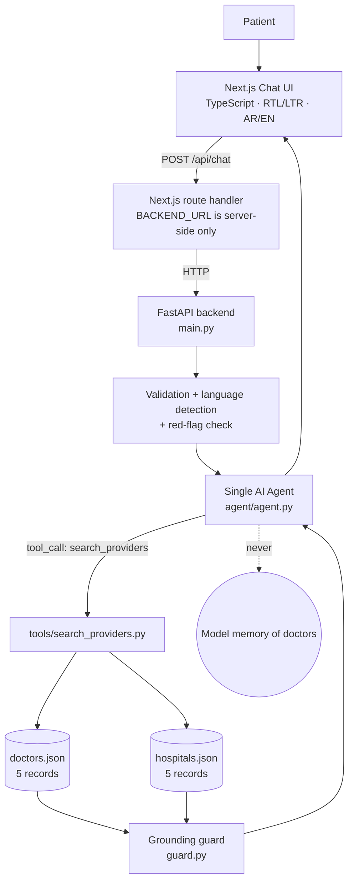

# HealTrip AI Patient Decision Assistant

> العربية | [Arabic version](./README.ar.md)

**A bilingual (Arabic / English) decision-support chat prototype.**
The patient describes a situation, one AI agent asks a clarifying question when
needed, recognises obvious emergencies, and recommends a next step. Any doctor
or hospital it names comes from a verified tool call against a small mock
database — never from the model's memory.

> ⚠️ **Prototype disclaimer.** This is a technical hiring prototype, not a
> medical device. It does not diagnose. All 5 doctors and 5 hospitals are
> clearly fictional demo records.

> 🔗 **Live demo:** <https://healtrip-ai.vercel.app> — both services run in one
> Vercel project (Next.js + FastAPI, see §15).

---

## 1. Project Overview

A patient types something like:

> "I have chest pain and I'm not sure whether I should see a cardiologist, go to
> the ER, or seek a second opinion."

The system must **not** immediately produce a random recommendation. Instead it:

1. understands the message (Arabic or English),
2. asks a clarifying question when the context is thin,
3. escalates obvious red flags ("severe chest pain and I cannot breathe") to
   immediate in-person care,
4. calls a backend tool **only** when provider information is needed,
5. returns doctors/hospitals that physically exist in `doctors.json` /
   `hospitals.json`,
6. says so honestly when no matching provider exists.

It is a **decision-support** prototype: it never states a diagnosis.

---

## 2. Architecture

```text
Patient
   ↓
Next.js Chat UI (TypeScript, RTL/LTR, bilingual)
   ↓  POST /api/chat          (browser only ever talks to its own origin)
Next.js route handler (frontend/app/api/chat/route.ts)
   ↓  server-side fetch to BACKEND_URL
FastAPI backend
   ↓  validation → red-flag check → language detection
AI Agent (single agent, native tool calling)
   ↓  "do I need provider data?"
   ├── no  → final answer
   └── yes → tool call: search_providers()
                ↓
          doctors.json / hospitals.json  (+ doctors.hospital_id → hospitals.id)
                ↓
          verified tool result
                ↓
          AI Agent → grounded reply + verified provider cards
   ↓
Next.js Chat UI
```



The one rule that matters:

```text
LLM → tool → mock data → verified result → LLM response
```

The model has **no path** to a provider record that did not come from a tool result.

---

## 3. Data Model

Two files, five records each, one foreign key:

```text
doctors.json
   d1 … d5          hospital_id ──┐
                                   ↓
hospitals.json
                  h1 … h5  (id)
```

- `doctors.hospital_id → hospitals.id` is a real relationship: when a doctor is
  returned by the tool, the backend resolves `hospital_id` against
  `hospitals.json` and attaches the hospital name, address and
  `emergency_available` flag to the same result.
- Both entities are validated with Pydantic models at load time; a broken file
  fails fast with a `MockDataError` instead of producing partial answers.
- Each record carries `name` and `name_ar` so Arabic replies are grounded in the
  same verified record instead of an invented transliteration.

This mirrors a simple relational model that could later map directly onto
PostgreSQL (`doctors.hospital_id REFERENCES hospitals(id)`). **No database is
used in this prototype.**

---

## 4. Data Flow

Example: *"I need a cardiologist in Riyadh."*

1. Patient sends the message in the Next.js UI.
2. UI `POST`s `{ message, language, history }` to `/api/chat` (same origin).
3. Next.js route handler forwards it server-side to `BACKEND_URL/api/chat`.
   `BACKEND_URL` and the LLM key are never exposed to the browser.
4. FastAPI validates the payload (Pydantic) and detects the language
   (`ar` / `en`).
5. The red-flag check runs. "I need a cardiologist in Riyadh" is not a symptom
   report and not an emergency, so no safety directive is added.
6. The message plus the system prompt go to the LLM.
7. The agent calls `search_providers(provider_type="doctor",
   specialty="Cardiology", city="Riyadh")`.
8. The backend searches `doctors.json` (`canon()` normalises "cardiologist",
   "cardio", "heart doctor" → *Cardiology*).
9. `Dr. Ahmed Salem` is found.
10. His `hospital_id = "h1"` is resolved against `hospitals.json`
    (Al-Noor Demo Hospital, Olaya District, emergency available).
11. The verified record is returned to the agent as the tool result.
12. The agent writes the answer **using only that record**.
13. `guard.py` re-checks the text: every provider-looking name must exist in the
    mock data, otherwise the reply is replaced with a safe message.
14. The API returns `{ reply, providers, tools_used, urgent, grounded }`.
15. The UI renders the text plus verified provider cards.

If nothing matches, the tool returns `match_count: 0` and the agent is
instructed to say: *"I couldn't find a matching provider in the available demo
provider data."*

---

## 5. AI Agent Design

**One agent.** No multi-agent orchestration, no LangGraph, no agent framework —
just a loop of `LLM → tool call → tool result → LLM` (`agent/agent.py`).

- **System prompt** states the job, then the hard rules: provider facts may only
  come from a tool result, never invent a provider, ask **one** clarifying
  question, never diagnose, reply in the patient's language, keep it short.
- **Context** is the last 8 turns sent by the browser. There is no server-side
  session, database or long-term memory.
- **Clarification** happens because (a) the prompt asks for one short question
  when context is thin and (b) `safety.py` adds a `CLARIFICATION` directive when
  a symptom is mentioned without an emergency.
- **Urgency** happens because `safety.py` detects a red-flag phrase and adds an
  `URGENCY` directive that forces immediate-care-first behaviour.
- **Language** is auto-detected from the message (Arabic characters → `ar`) and
  is also settable from the UI toggle; it drives the system prompt, error
  messages and the UI direction.
- **Loop safety valve**: `MAX_TOOL_ROUNDS` (default 5) stops a runaway loop. If the
  cap is hit, the agent gets one final call with tools disabled so the patient
  still receives an answer built on what was already verified.

---

## 6. Tool Calling

Native OpenAI-compatible function calling over plain `httpx` — no SDK wrapper,
so switching provider is a `.env` change.

| Tool | Purpose |
| --- | --- |
| `search_providers(provider_type, specialty?, city?, language?)` | The only way provider data reaches the model. `provider_type` selects `doctors.json` or `hospitals.json`. |
| `list_provider_filters()` | Returns the exact specialties / cities / languages that exist, so the agent can ask with filters that really match the demo data. |

Search behaviour:

- filters are optional and combine with AND;
- values are normalised (`cardiologist`, `cardio`, `heart doctor` → `Cardiology`;
  `En` → `English`) and matched exactly or by substring;
- doctor results are enriched with their hospital (relationship resolution);
- the payload sent back to the model carries `match_count` and an explicit note
  that the matches are the *only* real providers.

The API also returns `tools_used` (tool name + arguments + match count) so the
UI can show why the agent called a tool — useful for the interview demo.

---

## 7. Hallucination Prevention

Four layers, from strongest to weakest:

1. **Access control by design** — the system prompt never contains provider
   data, and the agent cannot read the JSON files. The only provider facts it
   can see are tool results.
2. **Closed vocabulary** — the agent is told to copy names verbatim from the
   tool result and that no matching record means "not in the demo data", never
   "here is a similar one from memory".
3. **Grounded rendering** — the provider cards in the UI are rendered from the
   structured `providers` array returned by the backend, not from the text. Even
   if the prose were wrong, the cards would still be real records.
4. **`guard.py` backstop** — after the reply is produced, every
   doctor/hospital-looking phrase (`Dr. X`, `… Hospital`, `مستشفى …`,
   `د. …`) is compared against the mock data. If anything is unknown, the reply
   is discarded and replaced with a safe message (Arabic or English), and the
   unverified names are logged — never returned to the browser.

```text
if unknown_provider_name_in(reply):
    reply = safe_fallback(language)
    providers = []          # cards are dropped too
else:
    reply, providers = as-generated
```

---

## 8. Medical Safety

Deliberately **minimal and readable** — this is not a triage engine:

- `safety.py` holds two short keyword lists (English + Arabic):
  *red flags* (severe chest pain, difficulty breathing, fainting / loss of
  consciousness, heavy bleeding, stroke signs, seizure, choking, severe
  allergic reaction…) and *symptom mentions* (pain, fever, dizziness, rash…).
- Red flag → the agent is instructed to put immediate in-person care (nearest
  emergency department or the local emergency number) **first**, not a routine
  appointment, and not to reassure. It never assumes a country-specific number.
  The API also returns `urgent: true` and a `safety_notice`, and the UI shows a
  red banner.
- Symptom but no red flag → the agent is instructed to ask one clarifying
  question before recommending anything.
- The system prompt forbids diagnoses and certainty in every turn, and the UI
  footer states that the tool does not replace a clinician or emergency
  services.

**Limitations**: keyword detection is not clinically validated, misses
phrasings, and produces false positives. Real clinical decision support would
require validated triage rules, safety review, and regulatory work — that is
explicitly out of scope here.

---

## 9. Security

- **API keys stay server-side.** The LLM key is read from the environment in
  `backend/settings.py` and used only in the FastAPI process. It is never sent to
  the browser, never included in an API response, and (verified) absent from the
  Next.js build output.
- **Environment variables only**, with `.env.example` documenting every variable
  and `.env` git-ignored.
- **Input validation** with Pydantic: message length (≤ 2000 chars), history
  length (≤ 12 turns), enum-checked `language` and `role`.
- **Safe error handling.** One error shape —
  `{"error": {"code", "message"}}` — with user-friendly English/Arabic text.
  Provider errors, stack traces, keys and env values are never forwarded
  (provider HTTP status is logged, not returned).
- **Rate/size limits** are out of scope, but the input caps and
  `MAX_TOOL_ROUNDS` bound the cost of a single request.
- **Privacy.** Conversation context is held in the browser and sent per request;
  nothing is persisted, no analytics, and medical text is never written to logs
  (only error codes, HTTP statuses and validation error types).
- No authentication by design (out of scope) — this prototype must not be used
  with real patient data.

Handled failure paths (all verified):

| Situation | Response |
| --- | --- |
| Missing `LLM_API_KEY` | `503 missing_api_key` |
| Invalid key / provider error / unreachable provider | `502 llm_unavailable` |
| Provider timeout | `504 llm_timeout` |
| Empty or invalid message | `422 invalid_request` |
| Invalid mock JSON | `500 mock_data_error` |
| Bad tool arguments | tool result returns `{"error": ...}` to the model, no crash |
| Backend down (seen by the UI) | `502 backend_unreachable` |
| Unexpected error | `500 internal_error` |

---

## 10. Why Mock JSON Data?

This is a time-boxed technical prototype focused on demonstrating AI agent
behaviour, tool calling, safe data grounding and full-stack integration. Local
JSON files keep it easy to run, review and explain — `cat doctors.json` is the
entire "database" — while preserving a clear data model that could later migrate
to PostgreSQL or another persistent store. A database in this prototype would
add infrastructure without demonstrating anything new about the assignment.

## 11. Why Separate Doctors and Hospitals?

Doctors and hospitals are different entities with different attributes
(`specialty` vs `specialties`, `hospital_id` vs `address` /
`emergency_available`). Keeping them separate makes the relationship explicit
(`doctors.hospital_id → hospitals.id`), shows basic data modelling, and is the
shape that maps cleanly to two tables later. Collapsing them into one document
would hide that relationship.

---

## 12. Technology Decisions

| Choice | Why |
| --- | --- |
| **Next.js (App Router) + TypeScript** | Small, familiar full-stack shell with a server-side route handler, so the browser never needs the backend URL. Type safety across the API boundary. |
| **Plain CSS, no UI framework** | The brief is about architecture, not design systems. One `globals.css`. |
| **FastAPI** | Small, typed, async, and self-documenting — the whole backend is ~6 small modules. |
| **JSON mock data** | Fast, reviewable, zero infrastructure (see §10). |
| **One AI agent** | The point is a clean, explainable loop. Multi-agent orchestration would add indirection without adding evidence. |
| **Native tool calling over raw HTTP** | Keeps the provider layer to one small module: change `LLM_PROVIDER`/`LLM_BASE_URL`/`LLM_MODEL` and the app works unchanged. No abstraction framework. |
| **Two tools only** | `search_providers` (the required one) plus a tiny `list_provider_filters` that prevents the model from searching with filters that cannot match — a reliability win for ~15 lines. |

Provider configuration (`.env`): `LLM_PROVIDER` (`openai`, `groq`,
`deepseek`, `openrouter`, or any OpenAI-compatible endpoint), `LLM_API_KEY`,
`LLM_MODEL`, `LLM_BASE_URL`.

---

## 13. Local Setup

Requirements: Python 3.11+, Node.js 18+.

```bash
# 1. Backend
cd backend
python -m venv .venv
.venv\Scripts\activate        # macOS/Linux: source .venv/bin/activate
pip install -r requirements.txt
cd ..

# 2. Configuration (root of the repository)
cp .env.example .env          # then paste your LLM_API_KEY and pick LLM_PROVIDER

# 3. Run the backend (http://127.0.0.1:8000)
cd backend
uvicorn main:app --reload --port 8000

# 4. Run the frontend (http://localhost:3000) in a second terminal
cd frontend
npm install
npm run dev
```

The frontend defaults to `BACKEND_URL=http://127.0.0.1:8000`, so no extra
configuration is needed locally. To point it elsewhere, create
`frontend/.env.local` with `BACKEND_URL=...`.

Try it:

- `I need a cardiologist in Riyadh.` → tool call → verified doctor + hospital
- `I have chest pain and I'm not sure what to do.` → clarifying question
- `I have severe chest pain and I cannot breathe.` → urgent banner, no routine referral
- `Is there a dermatologist in Riyadh?` → honest "not in the demo data"
- `أريد طبيب قلب في الرياض.` → same flow, Arabic, RTL layout

Tests (offline, no LLM key needed):

```bash
cd backend && python -m pytest tests -q     # 27 offline tests
cd frontend && npm run typecheck && npm run build
```

They cover the deterministic layers: mock-data loading and validation (invalid /
missing JSON), doctor + hospital search, natural-phrasing filters, `hospital_id`
relationship resolution, the agent loop with a stubbed LLM client (tool dispatch,
no-match honesty, bad tool arguments), red-flag / symptom detection, language
detection, and the hallucination guard in both scripts.

---

## 14. Environment Variables

| Variable | Used by | Default | Description |
| --- | --- | --- | --- |
| `LLM_PROVIDER` | backend | `openai` | `openai`, `groq`, `deepseek`, `openrouter` (label only). |
| `LLM_API_KEY` | backend | – | **Required.** Never sent to the browser. |
| `LLM_MODEL` | backend | per provider | e.g. `gpt-4o-mini`, `openai/gpt-oss-120b`, `deepseek-chat`. |
| `LLM_BASE_URL` | backend | per provider | Override for any OpenAI-compatible endpoint. |
| `LLM_TIMEOUT_SECONDS` | backend | `45` | Upstream timeout. |
| `MAX_TOOL_ROUNDS` | backend | `5` | Tool-calling loop cap. |
| `CORS_ORIGINS` | backend | `http://localhost:3000` | Comma-separated, local dev only. |
| `BACKEND_URL` | frontend (server) | `http://127.0.0.1:8000` | Backend base URL for the route handler. On Vercel this is injected by the service binding — do not set it. |
| `NEXT_PUBLIC_APP_LANG` | – | – | Not used; the UI language is a client-side toggle. |

`.env.example` is committed; `.env` is not.

---

## 15. Vercel Deployment

Both services deploy to **one Vercel project** using Vercel Services (each
framework is detected per service, built independently, and routed from a shared
domain). The whole deployment is described by the committed `vercel.json`:

```json
{
  "services": {
    "frontend": {
      "root": "frontend/",
      "framework": "nextjs",
      "bindings": [
        { "type": "service", "service": "backend", "format": "url", "env": "BACKEND_URL" }
      ]
    },
    "backend": { "root": "backend/", "framework": "fastapi", "entrypoint": "main:app" }
  },
  "rewrites": [{ "source": "/(.*)", "destination": { "service": "frontend" } }]
}
```

What this means in practice:

- `backend/` builds on the Vercel **Python runtime** (Fluid compute) and exposes
  the `app` object from `backend/main.py`. `doctors.json` / `hospitals.json` ship
  inside the function bundle and are read-only at runtime.
- `frontend/` builds as **Next.js**. Every public request goes to the frontend
  service, so the browser-facing `/api/chat` proxy stays exactly as it is locally.
- The **service binding** injects the backend's internal URL into the frontend as
  `BACKEND_URL`. The Next.js route handler already reads `process.env.BACKEND_URL`,
  so no application code changed for the deployment — the call travels over
  Vercel's internal network instead of the public internet, and the backend stays
  **not publicly routable**.
- **Do not set `BACKEND_URL` as a project environment variable.** The binding
  provides it; a manual value would override the internal URL.

Steps:

1. Import the repository at vercel.com/new (Root Directory = repository root, so
   `vercel.json` is picked up).
2. Add environment variables in Project Settings (they apply to both services):
   `LLM_PROVIDER`, `LLM_API_KEY` (secret), `LLM_MODEL`. Everything else already
   has safe defaults. `CORS_ORIGINS` is not required here because the browser
   only ever calls the Next.js origin.
3. Deploy, then verify with `GET /` (UI) and `POST /api/chat`
   (frontend → binding → FastAPI → LLM provider).

Local parity: `vercel dev -L` runs both services with the same routing and the
same injected binding, which is how the frontend↔backend handshake was verified
before deploying.

No Docker, no containers, no second provider, no database.

---

## 16. Limitations / Future Production Improvements

This prototype deliberately stops here. A production version would need:

- PostgreSQL instead of JSON files (same two-entity model, real migrations),
- authentication and role-based access,
- persistent, encrypted conversation storage with retention rules,
- clinically validated triage rules and clinical safety review,
- rate limiting, cost controls, observability/monitoring and audit logging,
- real provider data with licensing, plus appointment/booking integration.

None of these are implemented here, and none of them are needed to evaluate the
agent, tool-calling and grounding design.

---

## 17. Project Structure

```text
healtrip-ai/
├── frontend/
│   ├── app/
│   │   ├── api/chat/route.ts     # server-side proxy to the backend
│   │   ├── globals.css
│   │   ├── layout.tsx
│   │   └── page.tsx
│   ├── components/
│   │   ├── Chat.tsx              # bilingual chat UI, RTL/LTR
│   │   └── ProviderCard.tsx      # renders verified provider records
│   └── lib/{api.ts,i18n.ts}
├── backend/
│   ├── main.py                    # FastAPI app, POST /api/chat, error handling
│   ├── settings.py                # env configuration (keys stay server-side)
│   ├── schemas.py                 # request/response models
│   ├── llm_client.py              # OpenAI-compatible HTTP client
│   ├── safety.py                  # red-flag + symptom detection, directives
│   ├── guard.py                   # hallucination backstop
│   ├── agent/agent.py             # THE single agent (loop + tool calls)
│   ├── tools/search_providers.py  # search_providers + list_provider_filters
│   ├── data/{doctors,hospitals}.json   # 5 + 5 fictional records
│   └── tests/test_prototype.py    # 27 offline tests
├── .env.example
├── vercel.json                   # one Vercel project: Next.js service + FastAPI service + binding
├── README.md
└── README.ar.md
```

## 18. Verified Behaviour

Checked end-to-end against a live LLM (Groq, `openai/gpt-oss-120b`):

- doctor search + `hospital_id` resolution · hospital search · natural phrasing
  ("cardiologist", "cardio") · **no-match honesty** in both languages ·
  clarification question for a symptom · urgent red-flag escalation with no
  routine referral · Arabic and English replies · RTL/LTR UI toggle ·
  verified provider cards · hallucination guard blocking invented names in both
  scripts · every error path in §9 · no API key in the frontend bundle.
